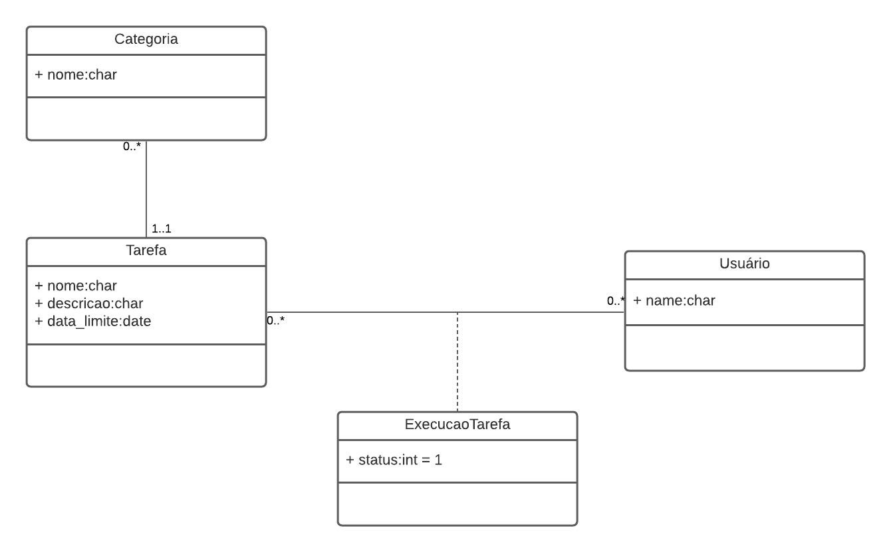

# Lista de Tarefas

## O que é

O projeto consiste em um sistema genérico de lista de afazeres, onde um usuário pode adicionar tarefas a serem feitas, 
classificadas por categorias, e atribuí-las a N usuários, podendo alterar o status de execução individualmente para 
cada um.

#### Exemplos de utilização
- Em uma sala de aula onde o professor cadastra uma tarefa e atribui a seus alunos.
- Em casa onde serão anotadas as tarefas domésticas que a mãe passa a seus filhos.
- Em uma empresa pequena onde serão anotados os afazeres e atribuído a um ou mais usuários dependendo do nível de 
dificuldade de execução.

## Diagrama de classes

## Deploy
https://todolist-devweb2.herokuapp.com/

- login: admin 
- senha:admin